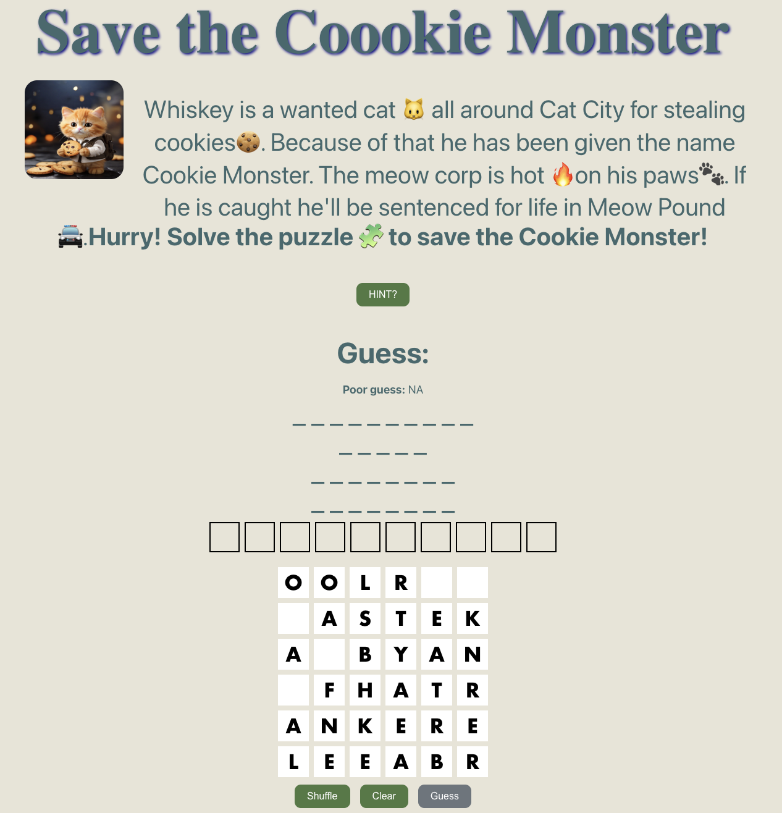

# Save The Cookie Monster

Welcome to Save The Cookie Monster! A captivating React app centered around solving word puzzles to rescue our adorable feline friend, the Cookie Monster! Inspired by a real cat named Whiskey, who is a wanted cat all around Cat City for stealing cookies. Because of that, he has been given the name Cookie Monster. The Meow Corp is hot on his paws. If he is caught, he'll be sentenced for life in Meow Pound. What are you waiting for? Join the exciting journey of wordplay and adventure!

# Technologies Used
This project was created with:
- React
- JavaScript
- HTML/CSS.

# Features
1. Solve word puzzles daily.
2. Experience an engaging storyline inspired by Whiskey the cat.
3. Enjoy colorful and intuitive user interface designed with HTML/CSS and React.

